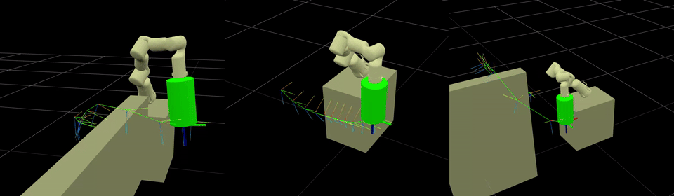

# Tesseract Python

## Quick Start



Run example scripts:
```bash
uv run examples/my_tesseract_planning_example_composer.py
# or
uv run examples/my_tesseract_planning_example_no_composer.py
# or
uv run examples/my_tesseract_kinematics_example.py
```

## Project Goal

- Enable motion planning for the Realman [RM65-B](https://www.realman-robotics.com/rm65-ae1.html) robot arm
- No ROS required

## Status

- URDF loads successfully with dummy gripper and TCP
- SRDF and plugins.yaml created manually for RM65-B robot
- Motion planning around obstacles tested and working

## Current Blockers

- [x] OMPL planner error: "All start states are either in collision or outside limits" (resolved by changing EEF pose (orientation, this robot ROM is limited))